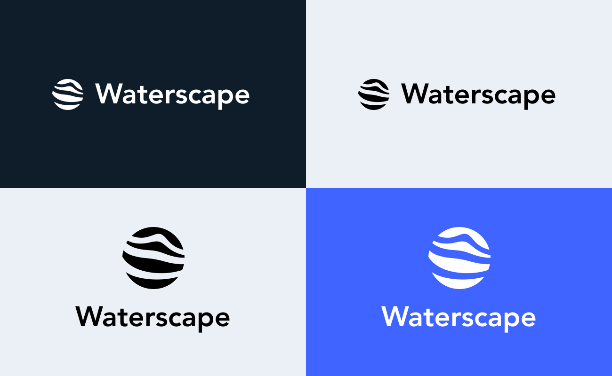

# assets

This document contains the rules for our visual communication system. Follow these rules strictly to maintain brand consistency. This includes all the elements you may need logos, typefaces, colors, and more.

## Logo

The logo consists of a symbol and a typeface. When the width is much greater than the height (form-strip), the logo below is preferred.

